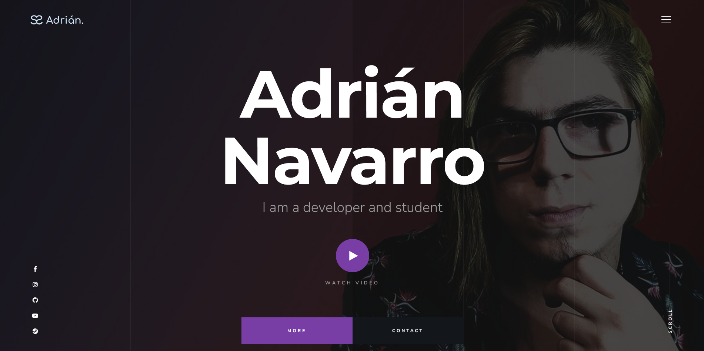

# Mi Portafolio (Versión Antigua)

Este es mi portafolio en su versión antigua. Fue creado utilizando una plantilla y ahora estoy trabajando en una nueva versión desde cero. La nueva versión será más moderna y reflejará mi progreso y habilidades actuales.

## ¿Por qué una nueva versión?

La razón para crear una nueva versión de mi portafolio es la siguiente:

- La versión actual se basó en una plantilla, lo que limitó mi capacidad para personalizar y mostrar mi singularidad.

- A medida que he adquirido nuevas habilidades y experiencia, quiero reflejar mejor mi crecimiento profesional.

- La nueva versión permitirá una presentación más atractiva y una mejor organización de mi trabajo y proyectos.

## ¿Qué puedo esperar en la nueva versión?

La nueva versión de mi portafolio incluirá:

- Diseño moderno y atractivo.

- Información actualizada sobre mí y mi experiencia.

- Descripciones detalladas de proyectos y logros relevantes.

- Una experiencia de usuario mejorada.

- Una navegación más intuitiva.

## Mantente al tanto

Mantente al tanto de las actualizaciones a medida que desarrollo mi nuevo portafolio. ¡Gracias por tu interés!

